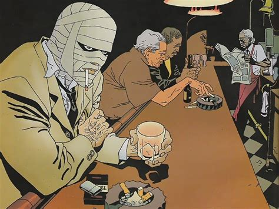
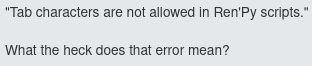
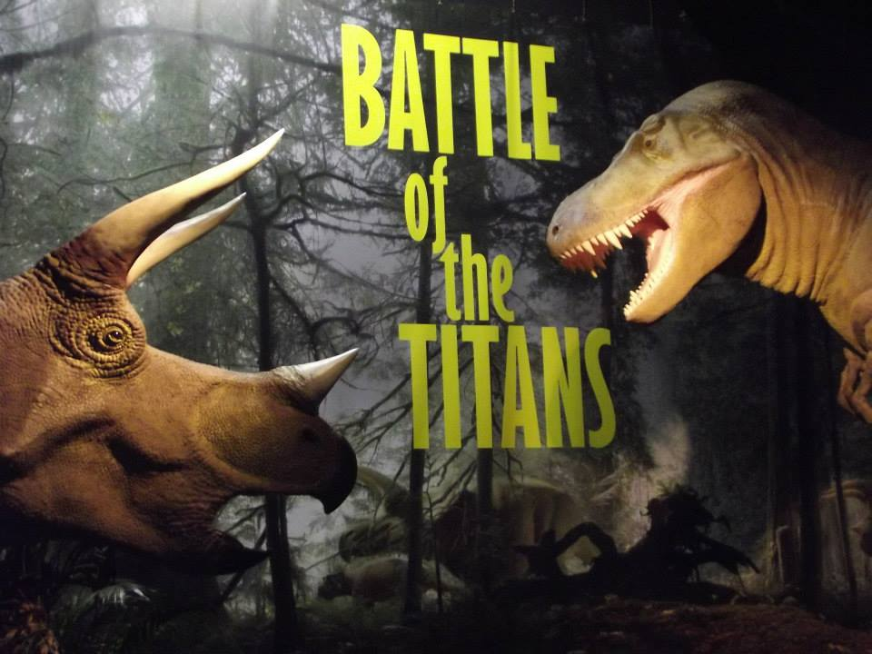
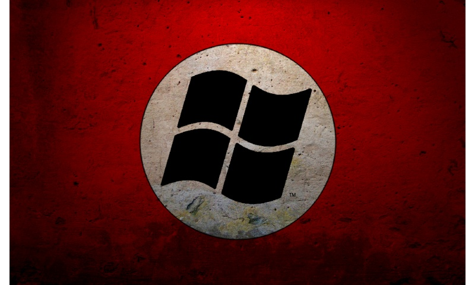

# Super Marian Dating Sim
---------------------------------
+ Kubis
+ Pliska

<<>>
## Animace

Mikuláš se přihlásil, že bude dělat animaci.

Dawid chyběl.

<<>>
### Idea

Animace vypadala sympaticky.

Nabízelo se zpracování známé povídky [*Plastic soldiers*](https://docs.google.com/document/d/1-aIxD_GheagFxuDhVp_X0G1NvYPB8MfaCgDtlZa69qw).



<<>>
### Zpracování

Před Vánocemi vznikl první snímek nadějné animace v Kritě.


<<>>
### ...

Idea byla rychle zahozena z důvodů komplikace příběhu, délce a škále projektu, nedostatku času a Miklášovy neschopnosti kreslit dynamické scény.

<<>>
### Idea #2

Vznik vcelku spontánní.

Dawid znal **RenPy**.

Započali jsme práce na SuperMarian Dating-Sim.

Práce šly celkem dobře jelikož Mikuláš měl talent na kreslení Nintendo postaviček.


<<>>
### SuperMarian Dating-Sim

Inspirováno ze stránky [DokiDokiLiteratureClub](https://ddlc.moe).

Prevence případné žaloby ze strany Nintenda: *Mario* -> *Marian*.


V plánu je napsat mírně vtipný, romantický a bizarní příběh.

<<>>
### Software

+ Neovim
+ Renpy Engine
+ Krita
+ Python
+ rustup, rustc, cargo
+ gcc
+ gource, ffmpeg
+ firefox

<<>>
### Technické poznámky

RenPy syntaxe je velice bizarní:
```renpy
label x:
	"hello"
	jump y

label y:
	"world"
	jump x
```
python support:
```python
python:
    player_health = max(player_health - damage, 0)
    if enemy_vampire:
        enemy_health = min(enemy_health + damage, enemy_max_health)
```
Nekonzistentní jazyk.

Rasismus na tabulátor ve skriptech:



<<>>
#### Tabs vs. Spaces



Krvavá debata o odsazování kódu.

`|	|` <-- tab, kódovaný 0000 1001

`| |`   <-- mezera, kódovaná 0010 0000

Takže pro 3000 řádku odsazeného kódu to je
`3000 * 3 * 8 = 72 000` ztracených bitů, což je celých 9 kilobytů - problém když jsou token trees definovány odsazením.

Argumentem proti tabům je například jejich variabilní délka.

<<>>
#### Python bytecode

Tenhle kus kódu:
```python
def hello()
    print("Hello, World!")
```
Se zkompiluje na:
```
2           0 LOAD_GLOBAL              0 (print)
            2 LOAD_CONST               1 ('Hello, World!')
            4 CALL_FUNCTION            1
```
Zrychlení "interpretace" - vyžaduje kompilaci projektu.

<<>>
#### Rendering v pygame


Pygame je backend pro renpy.

Abstrakční strom vypadá nějak takhle.

```
Python, Cpython - binarni kod - procesor
 |
Pygame - C - OpenGl - graficka karta
		 |
	  direct3d
	  	 |
	  graficka karta

```

<<>>
#### Multiplatform release



Renpy se dodáva na všechny používané operační systémy

... v jednom zipu - problém se spustitelností.

<<>>
### Prezentace


Pak zbývalo jen vytvořit prezentaci.

Beží to na rustovým backendu, frontend v markdownu.

Markdown se potom rozdělen na slejdy a zkompilován html.

To se pak stylizuje s jednotným css a vytváří tuhle stránku.

Všechny soubory, které je potřeba servovat jsou v mým [git repositáři](https://github.com/Dawidkubis/test).

<<>>
#### rust a rustový backend


Struktura backendu:
```
.
|-- Cargo.lock # lock na verze
|-- Cargo.toml # dependencies
|-- Makefile # pro make
|-- README.md # popis
|-- pressent -> target/release/pressent # symlink
`-- src # source
    |-- cli.rs # argumenty
    |-- main.css # css
    |-- main.js # javascript fuj fuj
    |-- main.rs # spousteni serveru
    |-- request.rs # specialni typy pro praci se souborem
    |-- response.rs # specialni typy pro praci s markdownem
    `-- routes.rs # endpointy
```

<<>>
#### proč rust?

+ Rust je bezpečný.
+ Rust je rychlý.
+ Rust má dobrou syntaxi.
+ Rust umí skvěle multithreading.

<<>>
#### gource záběry
+ [marian](https://drive.google.com/file/d/1EyIXlh5UfTlCK6vTmyOWpZdnqGF8BiUw/view?usp=sharing)
