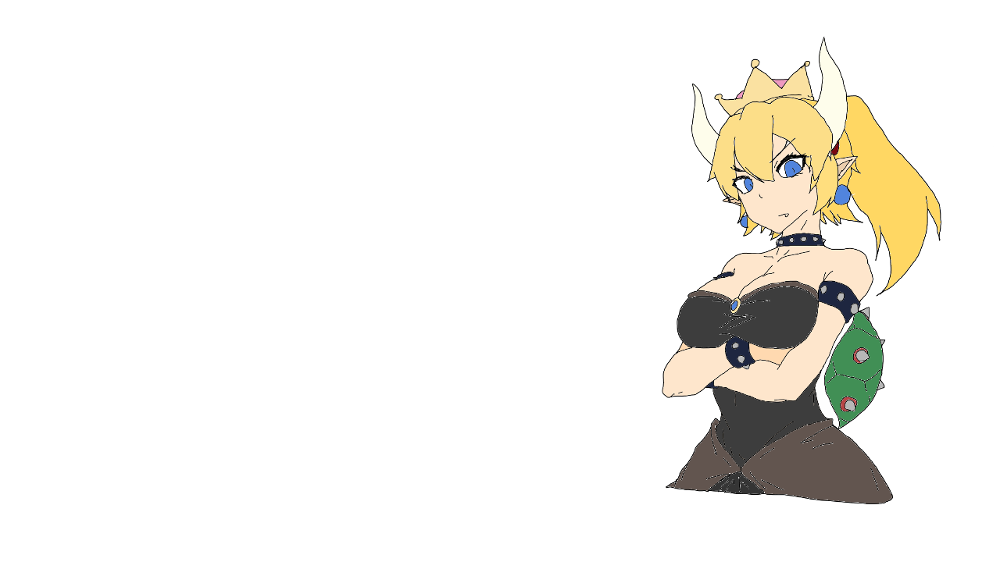

# Super Marian Dating Sim
---------------------------------
+ Kubis
+ Pliska

## Animace

Mikuláš se přihlásil, že bude dělat animaci.

Dawid chyběl.

### Idea

Animace vypadala sympaticky.

Nabízelo se zpracování známé povídky [*Plastic soldiers*](https://docs.google.com/document/d/1-aIxD_GheagFxuDhVp_X0G1NvYPB8MfaCgDtlZa69qw).


### Zpracování

Před Vánocemi vznikl první snímek nadějné animace v Kritě.

Ten snímek byl navždy ztracen.


Idea byla rychle zahozena z důvodů komplikace příběhu, délce a škále projektu, nedostatku času a Miklášovy neschopnosti kreslit dynamické scény.

### Idea #2

Vznik vcelku spontánní.

Dawid znal **RenPy**.

Započali jsme práci na SuperMarian Dating-Sim.

Práce šly celkem dobře jelikož měl Mikuláš talent na kreslení nintendo postaviček.



### SuperMarian Dating-Sim

Inspirováno ze stránky [DokiDokiLiteratureClub](https://ddlc.moe).

Ochrana proti soudění se s Nintendo: `Mario` -> `Marian`.


V plánu je napsat mírně vtipný, romantický a bizardní příběh.

### Technické poznámky

RenPy syntaxe je velice bizardní:
```renpy
label x:
	"hello"
	jump y

label y:
	"world"
	jump x
```
Je tam někde i python support ze kterého to prý má vycházet:
```python
python:
    player_health = max(player_health - damage, 0)
    if enemy_vampire:
        enemy_health = min(enemy_health + damage, enemy_max_health)
```
Celkem divné - dávalo by větší smysl dělat konzistentní jazyk.

Dodatečně je renpy rasistické na tabulátor ve skriptech:


#### Tabs vs. Spaces


Krvavá debata o odsazování kódu.

`	` <-- tohle je tab, kódovaný 0000 1001

` `   <-- tohle je mezera, kódovaná 0010 0000

Takže pro 3000 řádku odsazeného kódu to je
`3000 * 3 * 8 = 72 000` ztracených bitů, což je celých 9 kilobytů.

To je problém když jsou token trees definovány odsazením.

Proti tabům jsou argumenty jako variabilní délka.

#### python bytecode

```python
def hello()
    print("Hello, World!")
```

```
2           0 LOAD_GLOBAL              0 (print)
            2 LOAD_CONST               1 ('Hello, World!')
            4 CALL_FUNCTION            1
```

#### rendering v pygame

#### multiplatform release

### Prezentace

#### rust
